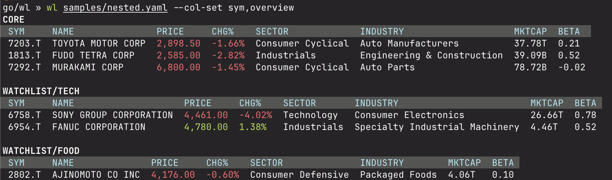

# wl — watchlists for terminal geeks

A small CLI tool to render stock watchlists from YAML files. It fetches quotes and fundamentals from Yahoo Finance (via `github.com/komsit37/yf-go`) and prints a compact table or JSON.



## Why?

- Fragmentation: I keep watchlists across multiple tools; syncing them is painful.
- Files > forms: a local YAML file is faster to edit and easy to version.
- Version‑controlled: keep a short thesis with each symbol, commit to Git, and view the thesis history.
- Terminal‑first: faster, more organized, and AI‑context friendly.
- Tool gaps: TradingView isn’t customizable, TIKR feels slow, and Koyfin often lacks up‑to‑date prices for Japanese stocks.

This project is part of my initiatives to move more of my investing workflow into the terminal. My research lives in Markdown; keeping the watchlist next to those notes—with custom fields—keeps everything simple and efficient.

## Who Is This For?

Geeky investors who like the terminal. It’s not aimed at everyday investors.

## Features

- Simple, flexible YAML watchlists: supports single files or nested, multi‑level groups ([see samples/](samples/)).

```yaml
watchlist:
  - sym: 7203.T
    note: core
    good: profitable biz
  - sym: 1813.T
  - sym: 7292.T
```

- Customizable columns: choose explicit columns or sets; display any field from your YAML alongside many Yahoo‑backed columns. Discover columns with `-l` / `--list-cols`:

```bash
go/wl » wl --list-cols
price: chg%,name,price
assetProfile: address1,avg_officer_age,business_summary,ceo,city,country,employees,hq,industry,ir,officers_count,phone,sector,website,zip
financialData: analysts,cash,cr,de%,debt,earn_g%,fcf,gm%,ocf,om%,pm%,qr,reco,rev_g%,rev_ps,roa%,roe%,tgt_mean
summaryDetail: 200d_avg,50d_avg,52w_high,52w_low,5y_avg_div_yield,ath,atl,avg_vol,avg_vol10d,beta,ccy,day_high,day_low,div_rate,div_yield%,ex_div,mktcap,open,payout%,pe_fwd,pe_ttm,prev_close,ps_ttm,vol
base: sym
```

## Install

- Go 1.21+
- Install the CLI:

```
go install github.com/komsit37/wl/cmd/wl@latest
```

This provides the `wl` binary in your `$GOBIN` or `$GOPATH/bin`.

## Quick start

- Try it with the sample data:

```
# Basic render
wl samples/simple.yaml

# Nested groups with a custom column set from the sample config
wl samples/nested.yaml --config samples/config.yaml --col-set "sym,overview"
```

- List available columns and sets:

```
wl --list-cols
wl --config samples/config.yaml --list-col-sets
```

- Show watchlist names (derived from file, directory layout, and group names):

```
wl samples/nested --list
```

## Usage

```
Render a watchlist

Usage:
  wl [file|dir] [flags]

Flags:
  -C, --col-set string      comma-separated column sets: price,assetProfile
  -c, --cols string         comma-separated columns to display
      --config string       path to config file (default: $WL_HOME/config.yaml or ~/.wl/config.yaml)
      --db-dsn string       database DSN for db source
  -f, --filter string       filter watchlists by name: substring (ci), name[,name...], glob, or /regex/
  -h, --help                help for wl
      --list                list watchlist names only
  -L, --list-col-sets       list column sets in compact form (built-in + config)
  -l, --list-cols           list available column names
      --max-col-width int   max width per column before wrapping (characters) (default 40)
      --desc                sort in descending order (default asc)
      --no-color            disable color output
  -o, --output string       output format: table|json (default "table")
  -p, --pretty              pretty-print JSON output
  -s, --sort string         sort rows by column (handles text, numbers, formatted values, and chg%)
      --source string       data source: yaml|db (default "yaml")
```

### Sorting

Use `--sort <column>` to sort table rows by a column. Sorting understands text, numeric values, formatted numbers (e.g., `$1,234`, `1.2B`), and percentages (e.g., `chg%`). Add `--desc` to sort in descending order.

Examples:

```
wl <path> --cols "sym,name,price,chg%" --sort chg% --desc      # top gainers first
wl <path> --col-set "sym,overview" --sort price                # lowest price first
wl <path> --cols "sym,note,rank" --sort rank                   # YAML field numeric
wl <path> --cols "sym,note" --sort note                        # YAML field text
```

## YAML format

A watchlist file contains a `watchlist` key. Items can be flat or grouped. You may also specify an explicit column order with `columns`.

Minimal example (samples/simple.yaml):

```yaml
columns: [sym, note, good]
watchlist:
  - sym: 7203.T
    note: core
    good: profitable biz
  - sym: 1813.T
  - sym: 7292.T
```

Nested groups (samples/nested.yaml):

```yaml
watchlist:
  - name: core
    watchlist:
      - sym: 7203.T
        note: core
        good: profitable biz
      - sym: 1813.T
      - sym: 7292.T

  - name: watchlist
    watchlist:
      - name: tech
        watchlist:
          - sym: 6758.T
            note: Sony
          - sym: 6954.T
            note: Fanuc
      - name: food
        watchlist:
          - sym: 2802.T
            note: Ajinomoto
```

- File or directory: Pass a single YAML file or a directory. If you pass a directory, `wl` discovers all `*.yaml|*.yml` recursively, derives names from relative paths, and renders multiple tables.
- Names: If a list/group has no `name`, `wl` uses the file or path to derive a stable name.

## Config and column sets

`wl` has built-in sets for each Yahoo module (`price`, `assetProfile`, `financialData`, `summaryDetail`). It also supports a special dynamic set `yaml` that expands to all custom fields present in your YAML items. You can define your own sets in a config file and reference them via `--col-set`.

Sample config (samples/config.yaml):

```yaml
col_sets:
  sym: [sym, name]
  overview: [price, chg%, sector, industry, mktcap, beta]
  valuation: [pe, pe_fwd, ps_ttm, roe%, roa%]
  dividends: [div_rate, div_yield%, payout%, ex_div, 5y_avg_div_yield]
  margins: [gm%, om%, pm%]
  growth: [rev_g%, earn_g%]
  cashflow: [cash, debt, fcf, ocf]
  volume: [avg_vol, avg_vol10d, vol]
  ranges: [50d_avg, 200d_avg, 52w_high, 52w_low, ath, atl]
  targets: [tgt_mean, reco, analysts]

# Use the dynamic YAML fields set inline with others
# --col-set "sym,overview,yaml" will expand `yaml` into all custom fields
```

Use sets and/or explicit columns; sets expand first, then explicit columns append:

```
# Using custom sets from config
wl <path> --config path/to/config.yaml --col-set "sym,overview,valuation"

# Explicit columns override order or add fields
wl <path> --cols "sym,name,price,chg%,sector,industry"
```

List what’s available:

```
wl --list-cols                         # group by data module
wl --config <cfg> --list-col-sets      # built-in + your custom sets
```

## Filters and output

- Filter by list name: substring (case-insensitive), exact names (comma-separated), glob, or regex:

```
wl <dir> --list --filter Tech             # substring
wl <dir> --filter "Core,watchlist/food"   # exact names
wl <dir> --filter "watchlist/*"           # glob
wl <dir> --filter "/^watchlist\/tech$/"  # regex
```

- Output formats:
  - `--output table` (default). Use `--no-color` to disable color and `--max-col-width` to wrap long text.
  - `--output json` with `--pretty` for human-readable JSON.

## Data sources and home directory

- `--source yaml` reads from a YAML file or a directory.
- `--source db` is reserved; not implemented yet.
- WL home directory resolves as follows:
  1) `--config` points to a file (its directory is treated as WL home),
  2) `$WL_HOME` (or `Wl_HOME`) environment variable, else
  3) `~/.wl`.

If no path argument is provided, `wl` loads from `$WL_HOME/watchlist`.

## Notes

- Columns are resolved case-insensitively and support aliases (e.g., `div` = `div_rate`, `div%` = `div_yield%`).
- Network access is required to fetch data at render time.
- The screenshot above is referenced at `refs/screenshot.png`.
